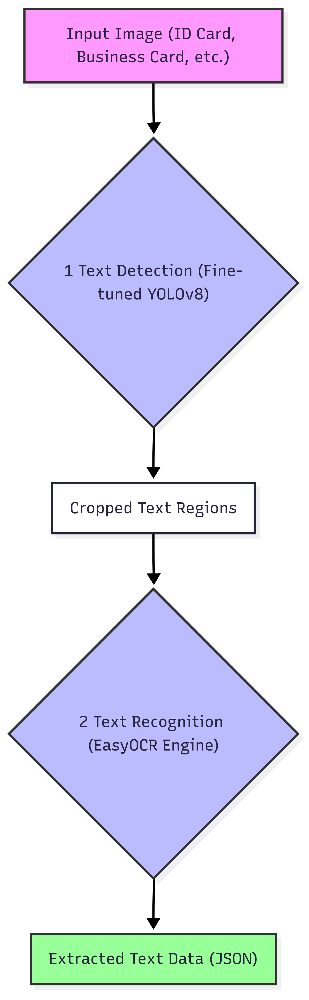

# AI Engineering Portfolio - Tran Dang Quyet

### Hello! I'm Quyet, an AI Engineer with over 2 years of hands-on experience in building and deploying machine learning solutions.

This repository serves as my technical portfolio. It provides a detailed look into the key projects I've developed, focusing on the **business problems, my technical solutions, and the challenges I overcame.** As most of the source code is proprietary, this portfolio emphasizes the "why" and "how" behind my work.

---

## 1. End-to-End Speech Recognition (ASR) System for Call Centers

### a. The Problem & Business Context

In a typical call center environment, managers and QA teams need to review call recordings to assess performance and gather customer insights. Listening to hours of audio is incredibly time-consuming and inefficient. The goal of this project was to build an automated system that transcribes these calls, providing a quick, searchable text-based summary. This directly impacts QA efficiency and allows for data-driven insights into customer interactions, such as identifying common issues or evaluating agent performance without manual listening.

### b. My Solution & Architecture

I designed and developed a multi-stage AI pipeline to process call recordings and enrich the transcribed text with additional metadata. The architecture was built to be modular, allowing for iterative improvements and the integration of new capabilities over time.

**Data Flow Diagram:**

  

**Key Components:**

*   **Core Speech-to-Text Engine: The Journey to High Accuracy**
    The system's backbone. I led the research and implementation through several key iterations, constantly balancing accuracy, latency, and resource cost:
    *   **V1 (wav2vec2):** Started with a popular choice for fine-tuning on custom datasets. While providing a decent baseline, it struggled significantly with the diversity of Vietnamese accents and real-world background noise present in our call recordings.
    *   **V2 (Whisper):** Moved to OpenAI's large model to leverage its powerful generalization capabilities. Accuracy saw a notable improvement, but its high latency and massive GPU memory footprint made it commercially unviable for our production server and real-time processing goals.
    *   **V3 (Chunkformer):** This was a breakthrough discovery. It offered a near-perfect balance, delivering **90-95% accuracy** *specifically on our challenging 8kHz audio data*, while being significantly lighter and faster than Whisper. This became our final, optimal solution.

*   **Speaker Diarization Module (MVP Approach):**
    As a pragmatic MVP solution to differentiate between speakers (e.g., "Agent:" vs. "Customer:"), I implemented a **K-Means clustering** algorithm on the timestamped outputs from the Chunkformer model. While its accuracy was moderate (~60-70%), it provided immediate value by making the transcripts far more readable and context-rich.

*   **Sentiment Analysis (Experimental Feature):**
    To provide a baseline emotional context, I integrated a pre-trained sentiment model (`5CD-AI/Vietnamese-Sentiment-visobert`). This proved effective for simple, direct utterances but highlighted the need for more advanced, context-aware models in future iterations, as it struggled with the complexity of real conversations.

*   **Infrastructure & Optimization:**
    *   Developed a **nightly batch processing system** using a message queue (RabbitMQ) to handle audio downloads and conversions (`.wav` to `.flac`), preventing bandwidth congestion during business hours and ensuring a 24-hour data refresh cycle.
    *   Independently **set up and maintained the GPU server environment**, including troubleshooting complex NVIDIA driver conflicts and intermittent CUDA errors, ensuring system stability.

### c. Key Challenges & Learnings

This project was a journey of iterative improvement and practical problem-solving, teaching me three critical lessons:

*   **Robustness Over Raw Power (The 8kHz Challenge):** A major challenge was that our source audio was only sampled at **8kHz**, half the standard 16kHz. Instead of immediately jumping into a costly fine-tuning process, my research led me to discover that the **Chunkformer architecture was surprisingly robust** and performed exceptionally well on this low-quality input. This taught me to always test for robustness and find the right tool for the specific data, not just the most powerful one.

*   **Pragmatism in Engineering (The "Good Enough" Principle):** The Speaker Diarization and Sentiment modules were not perfect, but they delivered immediate value. I learned that in a business context, an 80% solution delivered today is often more valuable than a 100% solution delivered in six months.

*   **Thinking Beyond the Model:** My biggest takeaway was that a successful AI project is far more than just the model itself. It involves building robust data pipelines, optimizing for infrastructure constraints (like server bandwidth), and managing the underlying hardware. My experience troubleshooting GPU drivers and CUDA errors was as valuable as any modeling work.

### d. Tech Stack
*   **Languages & Frameworks:** Python, FastAPI, Pika (for RabbitMQ)
*   **AI & Data Libraries:** Pytorch, Hugging Face Transformers, Librosa, Scikit-learn
*   **Infrastructure:** Docker, NVIDIA GPU Server (self-managed), RabbitMQ

---

## 2. Computer Vision System for Crop Disease Diagnosis

### a. The Problem & Business Context

This project was developed for a major agricultural partner (Ajinomoto) to create a "closed-loop" ecosystem for their cassava farmers. The goal was to build a mobile-friendly AI application that could:
1.  **Instantly diagnose** common cassava diseases from a single photo.
2.  **Provide immediate solutions** and connect farmers with local pesticide/fertilizer suppliers.
3.  Serve as a powerful marketing tool, showcasing the partner's commitment to leveraging advanced technology in agriculture.

### b. My Solution & A Two-Stage Architecture

Recognizing the challenges of real-world mobile captures, I designed a robust two-stage pipeline to ensure the reliability of the predictions.

**System Architecture:**

  

**Key Components:**

*   **Stage 1: Pre-filtering Gate (YOLOv8):**
    Before any classification, every incoming image was passed through a YOLOv8 model. This "gatekeeper" had two critical jobs:
    1.  **Object Validation:** Confirm that the image actually contains a cassava leaf.
    2.  **Quality Control:** Use a simple heuristic (bounding box size relative to the image) to ensure the leaf was captured at a close enough range for accurate diagnosis.
    This step was crucial to prevent the core model from processing irrelevant or low-quality images, significantly improving the system's overall reliability.

*   **Stage 2: Core Classification Engine:**
    If an image passed the gate, the cropped leaf region was sent to the main classification engine. Here, I conducted extensive research and benchmarking of various SOTA architectures (ResNet, ViT, EfficientNet) to find the best model for our specific dataset, ultimately achieving **70-80% accuracy** on real-world field data.

### c. Key Challenges & The Reality of "AI in the Wild"

This project was a masterclass in the difference between lab conditions and real-world deployment.

*   **Challenge 1: Building a Dataset from Scratch:**
    Unlike academic projects with clean, pre-existing datasets, we started with nothing. The data was scarce (diseases are rare) and collected by non-experts, resulting in significant noise (blurry images, bad lighting, incorrect angles). This taught me the critical importance of data-centric AI and the immense effort required in data collection and cleaning before any modeling can begin.

*   **Challenge 2: Using XAI as a Diagnostic Tool:**
    During training, I applied **XAI techniques** not just for interpretability, but as a powerful debugging tool. This led to two key insights:
    1.  It visually confirmed that the model was struggling to differentiate between two visually similar diseases (Bacterial Blight and Brown Spot), guiding our efforts in data augmentation.
    2.  Crucially, it revealed that for "Root Rot" disease, the model was looking at random features on the leaves. This proved that the core problem was a **data mismatch**: the disease's primary indicators are in the roots, which were not present in our leaf-based dataset. This insight saved us countless hours of trying to optimize a model for a problem it could never solve with the given data.

*   **Learning:** My biggest takeaway was that in the real world, a successful AI Engineer must be part data strategist, part researcher, and part systems architect. The final accuracy figure is only a small part of the story; understanding the data's limitations and building a robust system around them is what truly defines a successful project.

### d. Tech Stack
*   **Languages & Frameworks:** Python, FastAPI, Rabbimq(pika)
*   **AI & Data Libraries:** Pytorch, YOLOv8, OpenCV, Captum (for XAI), ResNet, ViT, EfficientNetV2
*   **Infrastructure:** Docker, Server-side Deployment
---
## 3. Multi-Document OCR Solution

### a. The Problem & Business Context

The project's primary goal was to automate the tedious manual data entry process from various documents like National ID cards (CCCD), InBody reports, and business cards. A key secondary objective for the National ID card was to create a robust **fallback solution** for cases where the built-in QR code scanning failed due to specific character encoding errors that we had identified in certain libraries.

### b. My Solution & A Two-Stage Architecture

I developed a flexible two-stage pipeline capable of handling both structured and unstructured documents.

**System Architecture:**

  

**Key Components:**

*   **Stage 1: Fine-tuned Text Detection (YOLOv8):**
    Instead of relying on generic text detectors, I **fine-tuned a YOLOv8 model** specifically on our document types. This allowed the system to accurately locate key information fields (like name, ID number, phone number) even on cluttered and inconsistent layouts, such as business cards.

*   **Stage 2: Robust Text Recognition (EasyOCR):**
    The cropped text regions from YOLOv8 were then passed to the powerful **EasyOCR engine**. This approach proved highly effective, achieving high accuracy on structured documents (like National ID cards) and providing a solid baseline for completely unstructured ones.

### c. Key Challenges & A Journey of Pragmatic Engineering

This project was a deep dive into the real-world challenges of OCR, teaching me invaluable lessons in iteration, debugging, and resource management.

*   **Challenge 1: The "Anything Goes" Data Problem:**
    The biggest hurdle was the extreme variability of business cards. Unlike structured documents, they have no standard format, featuring countless fonts, vertical/horizontal layouts, and artistic designs. This taught me that for unstructured data, a **detection-first approach (YOLO) is far more robust** than trying to apply a single OCR model to the entire image.

*   **Challenge 2: The Iterative Journey (PP-OCR vs. EasyOCR):**
    My initial implementation (V1) used PP-OCR due to its reputation for speed. However, I diagnosed a critical issue where it failed to correctly process spaces in Vietnamese text. My investigation revealed this was because the model was primarily optimized for Chinese, a language without space characters. Lacking the large, labeled dataset required for fine-tuning, I made a **pragmatic engineering decision to pivot to EasyOCR (V2)**, which offered superior out-of-the-box performance for our specific language needs.

*   **Challenge 3: Identifying Hardware Bottlenecks:**
    During deployment, I discovered a critical hardware dependency for EasyOCR, finding that it performed poorly on older CPUs lacking specific instruction sets. To ensure the system's performance met business requirements, I **diagnosed the hardware bottleneck and successfully advocated for the necessary GPU resources**, which ultimately enabled the project's effective deployment. This taught me that a successful AI solution often requires consideration of the full stack, from the model down to the hardware it runs on.

### d. Tech Stack
*   **Languages & Frameworks:** Python, FastAPI, RabbitMQ(pika)
*   **AI & Data Libraries:** Pytorch, YOLOv8 (fine-tuned), EasyOCR, OpenCV
*   **Infrastructure:** Docker, NVIDIA GPU Server